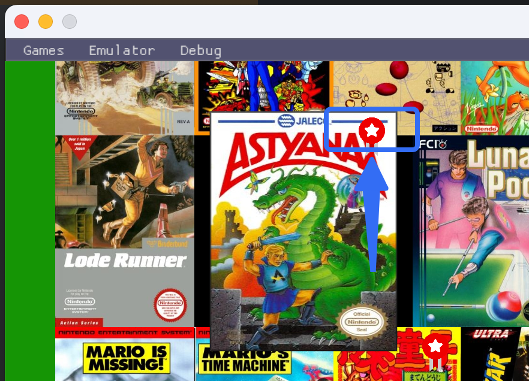

# Kiwi-Machine


## Basic Introduction

Kiwi Machine is a simple Nintendo Entertainment System (NES/FC) emulator engine. It provides a very simple interface to help implement NES emulators on various platforms.

## Why is there a Kiwi project?

I believe many people, like me, have had a gaming dream since childhood.

When Nintendo first launched the Famicom in 1983, the concept of video game consoles wasn't popular in China yet. By the time the concept reached my surroundings, I was already in elementary school. At that time, Jackie Chan's "XiaoBaWang(小霸王) is endless fun" commercials were on TV, opening a door to the electronic world for me.

From today's perspective, although XiaoBaWang was a knockoff of the Famicom and lagged behind the actual Famicom's development by more than five years — we were playing games that were five years old — it never made me feel these games were boring. On weekends, I would take out my family's XiaoBaWang console, insert game cartridges I had played hundreds of times like Super Mario, Donkey Kong, and Lode Runner, and play games with my grandparents.

Now my grandparents have passed away, but I still remember very clearly that my grandmother and grandfather, who almost never played games, had a special fondness for Tetris, Dr. Mario, and Tank Battle respectively. These were among the games we must play on weekends. When implementing the NES emulator, these were the first games I prioritized emulating. Whenever I hear the familiar music, I always think of the times when we played games together as a child.

Later, various game consoles explosively entered China, such as GameBoy, GameBoy Advance, PS, PS2, PSP, etc. At that time, game consoles were considered evil, a stumbling block to learning and progress, so I could never convince my family to buy me a GBA or NDS. I could only watch my classmates play with eager eyes or wait for them to lend me one so I could secretly play it under the covers at night. At that time, I thought that if I had the chance in the future, I would collect all the fun games from that time so my future children could experience what games were like decades ago.

Later, I engaged in software development work and began researching the hardware architecture of the NES, the principles and formats of NES games, and started implementing an NES emulator. Although there are many mature NES emulators currently available, I thought it would be a way to fulfill a dream for myself. What I looked forward to was creating a retro gaming world of my own, so I chose to manually implement and research the core framework myself, which became today's `Kiwi Machine`.

Developing an NES emulator wasn't so smooth. On one hand, I was very busy with work, and on the other hand, there wasn't much information available. NesDev is a very comprehensive NES Wiki, and I acquired most of my NES knowledge from it. In addition, I referenced many open-source NES projects like FCEUX and debugged ROMs line by line using FCEUX's debugger to add debugging capabilities to my `Kiwi Machine`.

NES games themselves are stored in cartridges, and different cartridges have different hardware called Mappers. Different Mappers work in different ways, which brings certain difficulties to the adaptation of various games. Additionally, some games may have been implemented in unusual ways, which requires hardcoding some special cases in the emulator (such as special IRQ timing) to adapt to these games.

For example:

- In Kirby and Ninja Gaiden 3, the IRQ trigger cycle is dot 280, not 260 as stated in NesDev. I changed all IRQs to dot 280.
- Kick Master needs to trigger IRQ twice in one scanline, otherwise screen flickering will occur.
- Games like Contra, Gradius, Jackal, and Guerilla War poll $2002 to see if they've entered VBL, and reading $2002 itself clears the VBL flag, so IRQ needs to be delayed by 15 PPU cycles after VBL is generated.
- The Tetris released by Tengen (my childhood memory) selects an overflowed CHR Bank, so modulo operation is needed, otherwise the screen will garble.
- In Zelda II: The Adventure of Link, you can't press left and right at the same time, otherwise the character will float.

In addition, some games use relatively niche Mappers, such as the Japanese version of Mario using Mapper 40, Solistice using Mapper 7, and games like the Chinese localized version of Metal Max from Taiwanese manufacturers using Mapper 74. I implemented all of these myself by referring to the Wiki and FCEUX. Some games may use specialized techniques, such as writing to an illegal address to wait for the CPU, which also need to be adapted one by one.

Although the core is implemented by myself, I still used some third-party libraries:

- APU: [Nes_Snd_Emu](https://github.com/blarggs-audio-libraries/Nes_Snd_Emu/)
- Interface library: ImGui
- Framework foundation: SDL2
  In addition, there are some common libraries like `zlib`, which I won't list repeatedly here.

The entire Kiwi kernel code is compatible with `Chromium`, including:

- The `kiwi::base` library in Kiwi is a subset of `Chromium`'s `base` and is completely compatible in terms of interface. However, there are some adjustments in the internal implementation.
- The code specifications of the Kiwi kernel are consistent with `Chromium` code specifications and programming style.

Consistent programming style means that the Kiwi kernel uses asynchronous programming, frequently using `SequencedTaskRunner` for `PostTask()`, without using locks in kernel business, and without opening extra threads. The entire Kiwi kernel has only one UI thread and one emulator thread. The UI thread is used to interact with the UI interface, while the emulator thread is used to simulate hardware such as CPU, PPU, and APU.

## Build Methods

### Supported Platforms

- MacOS
- Windows
- Linux
- Android (phone, TV)
- iOS

```
**Since ROM resources and code are currently separated, you need to manually copy ROM resource files (*.pak)**
**If you want the build system to automatically copy, you need to manually specify `-DKIWI_PACKAGE_DIR={your pak storage path}` during CMake build**
```

### Preparation Before Building
If you want to use the ROM resources prepared for you by Kiwi-Machine instead of packing them manually, you need to perform the following operations:

1. Choose a path, take `~/Documents/Kiwi-Machine-Workspace` as an example, and pull the code `git clone https://github.com/Froser/Kiwi-Machine-Workspace.git` in the directory. You can also complete this by running `build/workspace-sync.py`.
2. Compile `package_manager` first according to the method described next, run it with the command line `--workspace=~/Documents/Kiwi-Machine-Workspace`, and package the ROM into a pak file.
3. Build the main KiwiMachine, and specify `-DKIWI_PACKAGE_DIR=~/Documents/Kiwi-Machine-Workspace/out/output` in CMake, so it will automatically copy the pak files you generated to the resource directory.

If you are compiling for Android, you need to manually copy the pak files to the asset directory.

### MacOS, Windows, Linux Build Methods

You can build directly using CMake. The main products are `kiwi` and `kiwi_machine`.

### Android Build Method

Open the gradle project in `src/client/kiwi_machine_android` directly for building.

### iOS Build Method

Build through CMake:

```
-G Xcode -DCMAKE_TOOLCHAIN_FILE=build/cmake/ios.toolchain.cmake -DPLATFORM=SIMULATORARM64 -DENABLE_ARC=OFF -DSDL2IMAGE_BACKEND_IMAGEIO=OFF
```

You can replace PLATFORM with your own iOS platform, see `build/ios.toolchain.cmake` for details.

### WebAssembly (WASM) Build Method

You need to download the `Emscripten` SDK (`emsdk`) first, then set the toolchain to it in CMake, for example:

```
-DCMAKE_TOOLCHAIN_FILE=/Users/user/emsdk/upstream/emscripten/cmake/Modules/Platform/Emscripten.cmake
```

If you specify `KIWI_EMSCRIPTEN_BUILD_DIR`, the build system will build an automatically deployed project for you.

### Frontend Page Build Method

This project contains a frontend project located at `src/client/kiwi_machine_wasm/kiwi-machine`

Build method:

1. First build the WebAssembly product according to the `WebAssembly (WASM) Build Method`
2. Refer to calling `src/client/kiwi_machine_wasm/update.py your WebAssembly project directory` to copy the wasm product over
3. Use npm for frontend build and deployment

### Product Introduction

- kiwi: Emulator kernel.
- kiwi-machine: Emulator executable program running on desktop.

### Building Your Own Game Collection

Kiwi Machine is designed in an arcade mode, with a large number of preset games that I only included after testing:


During the build process, Kiwi Machine will read all files under `src/client/kiwi_machine/build/nes` and write them into the product binary file.

For example:

`Bomber Man II (Japan).zip` contains two files:

- `Bomber Man II (Japan).nes` is the main ROM file.
- `Bomber Man II (Japan).jpg` is the ROM cover file.

You can put multiple nes and jpg files in the `.zip` file, which will be treated as another version of the game.

For example, I've organized many games' Japanese, English, and even Chinese versions. When they are selected, there's a marker on them, and you can press the `SELECT` button to switch between versions:
> 

In addition, you can also put other similar sets of files into the zip, which represent another version of the game. For example, the American version of `Rock Man` is called `Mega Man`, so they can be put into the same zip file. Kiwi-Machine provides a package manager tool to facilitate you to package resources yourself.

### Building Debug ROMs

NES emulators are complex projects, and to test whether the emulator accurately simulates physical machines, Kiwi Machine supports custom debug ROMs.


Add `--enable_debug` to the startup parameters to evoke the menu bar and turn off the splash screen.
Add `--debug_roms=your debug path` to the startup parameters, and Kiwi Machine will display these ROMs in the debug directory after startup.

## Usage Instructions

### Kiwi's Dependencies

If you write your own emulator based on the Kiwi kernel, you can use `find_package(Kiwi REQUIRED)` to depend on the Kiwi kernel.

There are two targets in Kiwi: `Kiwi::kiwi` is a dynamic library, and `Kiwi::kiwi_static` is a static library.

Taking Kiwi Machine as an example, it uses Kiwi's static library target:

```CMake
target_link_libraries(${PROJECT_NAME} PRIVATE Kiwi::kiwi_static imgui gflags_nothreads_static SDL2_image SDL2_mixer)
target_include_directories(${PROJECT_NAME} PRIVATE Kiwi::kiwi_static)
target_compile_definitions(${PROJECT_NAME} INTERFACE Kiwi::kiwi_static)
target_include_directories(${PROJECT_NAME}
        PRIVATE
        "../../third_party/imgui"
)
```

After the project dependencies are completed, you can directly include all related content by `#include <kiwi_nes.h>`.

### Creating an Emulator

You can create a Kiwi NES emulator instance through `kiwi::nes::CreateEmulator()`:

```C++
scoped_refptr<kiwi::nes::Emulator> emulator = kiwi::nes::CreateEmulator();
```

After creation, you need to call its `PowerOn()` method for initialization:

```C++
emulator->PowerOn();
```

`PowerOn()` will initialize the emulator's power-on state and create the emulator's working thread. All public methods of the `kiwi::nes::Emulator` class should be called in the UI thread, which is your main thread, and it will be dispatched internally to the emulator's working thread. All emulator callbacks will only be returned in the thread where you called them.

This design means you only need to care about calling emulator methods in the UI thread, and callback functions will only return in the UI thread. You don't need to create new threads or use complex locks to maintain synchronization; Kiwi's internal mechanisms ensure no competition occurs.

### Reading NES Files

The Emulator class has a series of LoadFromXXX functions that can read an NES ROM from a file or memory:

```C++
  virtual void LoadFromFile(const base::FilePath& rom_path,
                            LoadCallback callback) = 0;
  virtual void LoadFromBinary(const Bytes& data, LoadCallback callback) = 0;
```

The above two functions should be called in the UI thread, and when they finish reading, the `callback` will be called back in the UI thread.

### Outputting Results

After opening an NES file, we want to output its content on a drawing surface and allow the emulator to produce sound and respond to keyboard or controller input.

Here, Kiwi abstracts a device layer called `IODevices`, representing the IO devices for emulator output. It contains three important devices:

- InputDevice: Input device, determines whether a certain NES key is pressed.
- RenderDevice: Renders one frame of NES screen.
- AudioDevice: Plays one frame of NES audio.

You need to implement these three abstract devices in order to fully interact with the emulator. If you only implement `RenderDevice`, you can only see the screen, but the emulator cannot respond to keyboard input or produce sound.

Taking `RenderDevice` as an example, you need to implement the following two pure virtual methods, `Render()` and `NeedRender()`:

```C++
  class NES_EXPORT RenderDevice {
   public:
    using Buffer = Colors;

   public:
    RenderDevice();
    virtual ~RenderDevice();

   public:
    virtual void Render(int width, int height, const Buffer* buffer) = 0;
    virtual bool NeedRender() = 0;
  };
```

After implementation, set it to the emulator through `Emulator::SetIODevices()`. When the emulator produces a frame, it will first call back `NeedRender()` to query if rendering is needed. If it returns `true`, it will call `Render()`, passing the frame's width, height, and specific content.

### Running the Virtual Machine

After the NES file is loaded, you can start the emulator. We need to call `Emulator::Run()` in the `LoadCallback` when reading the NES file to start it working.

To simplify the call, the emulator also provides a shortcut method:

```C++
  virtual void LoadAndRun(const base::FilePath& rom_path,
                          base::OnceClosure callback = base::DoNothing()) = 0;
  virtual void LoadAndRun(const Bytes& data,
                          base::OnceClosure callback = base::DoNothing()) = 0;
```

This means that when a ROM is read successfully, it will call `Emulator::Run()`, and then call `callback`.

## Resource Packaging

Kiwi-Machine provides an NES packaging tool located at `src/tools/package_manager`. You can package your favorite NES games into resources, as shown on the cover of this document.

This repository does not contain NES resources. If you need to obtain NES resources, you can clone `https://github.com/Froser/kiwi-machine-workspace` using git.
Open the package manager's GUI interface for packaging by running `package_manager --workspace {Kiwi-Machine's Workspace path}`.