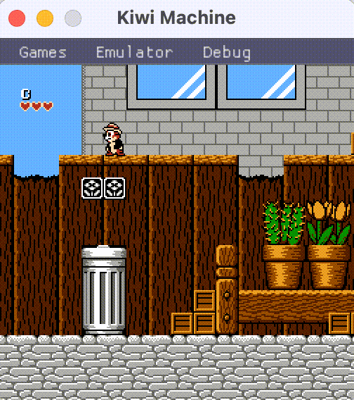
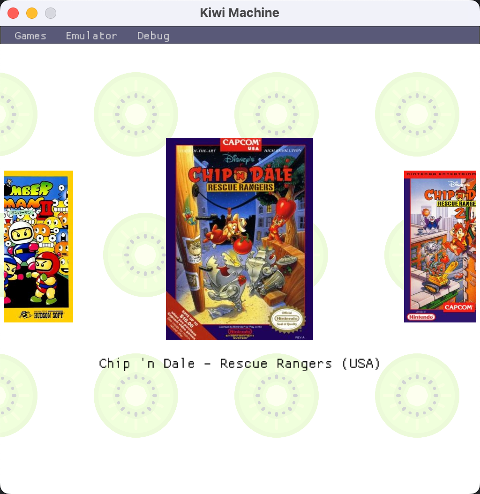
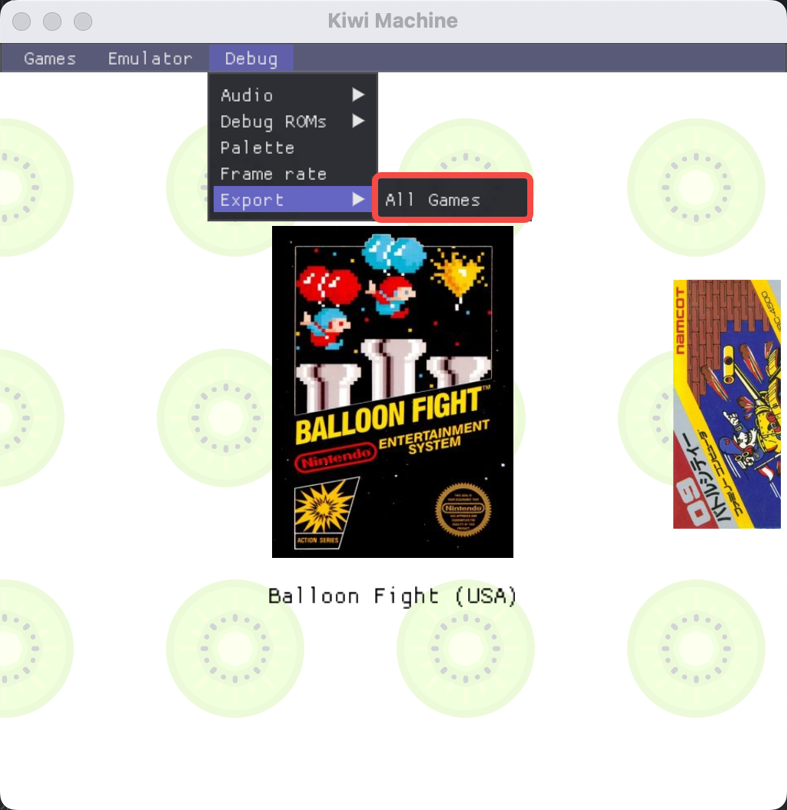
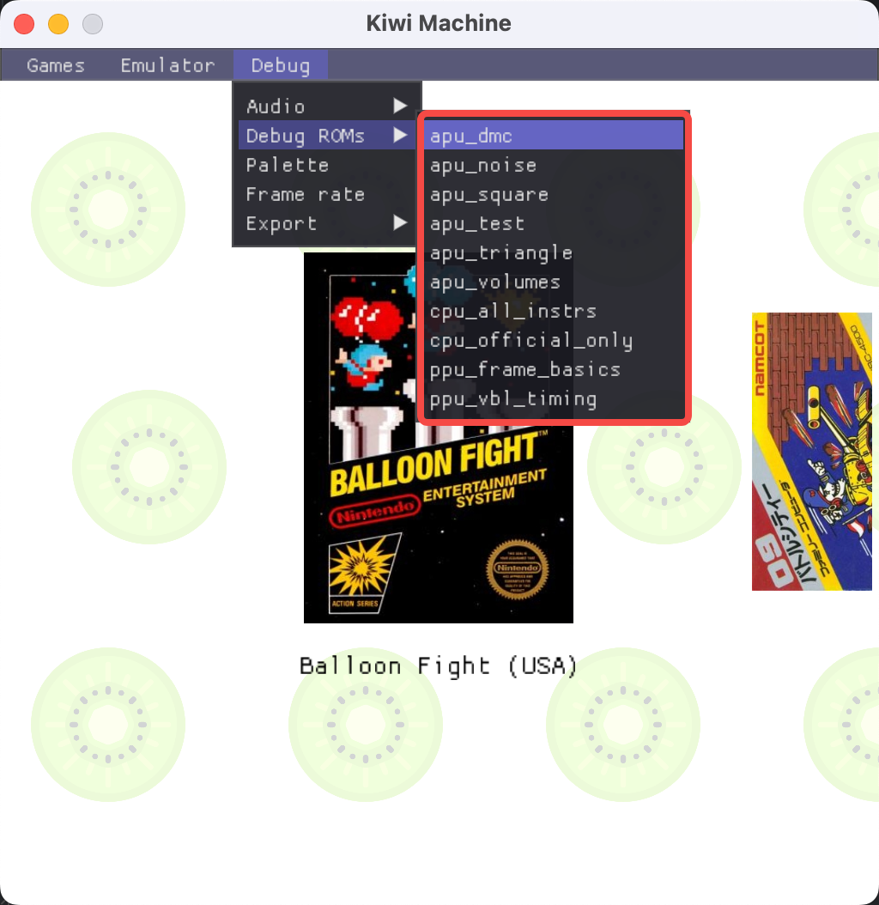

# Kiwi-Machine




## 基本介绍

Kiwi Machine是一个简单的任天堂红白机(NES/FC)模拟器引擎。里面提供了非常简单的接口，帮助实现各个平台下的红白机模拟器的开发。

## 为什么有Kiwi这个工程？

相信很多人和我一样，从小就有一个游戏梦想。

当任天堂在1983年首次在推出红白机时，游戏机这个概念还没在中国普及，等游戏机这个概念流传到我周围的时候，已经到了我读小学的时候，当时电视里放着
成龙的“小霸王其乐无穷”的广告，为我打开了一个电子世界的大门。

从现在的角度看，小霸王虽然是一个山寨的红白机，且比红白机真正发展晚了五年以上————我们玩的是五年前的游戏，但丝毫没有让我觉得这些游戏乏味。我在
周末的时候，就会拿出家里的小霸王游戏机，插上玩过几百遍的超级马里奥、大金刚、淘金者的游戏卡，和我的外公、外婆一起玩游戏。

现在外公外婆都已经过世，但是我仍然记得非常清楚，几乎从来不玩游戏的外婆、外公，分别对俄罗斯方块、玛丽医生和坦克大战情有独钟，这也是我们周末的时
候必玩的游戏之一。在我实现红白机的过程中，我优先模拟的就是这几款游戏。每当听到熟悉的音乐我总会想起小时候一起玩游戏的情形。

随后，各种各样的游戏机爆发式地来到了中国，如GameBoy、GameBoy Advance、PS、PS2、PSP等。当时，游戏机被认为是虎狼，是学习和进步的绊脚石，所
以我根本不可能说服家人给我买一个GBA，或者买个NDS，只能是眼巴巴地看着同学玩，或者是等他们借给我，我晚上躲在被子里偷偷玩一个晚上。当时我就在想，
如果以后有机会，我想要收集当时所有好玩的游戏，让以后我的小孩也体会一下，几十年前的游戏是什么样子。

后来，我从事了软件开发相关的工作，并且开始研究红白机的硬件架构、红白机游戏的原理、格式等，并且开始实现红白机模拟器。虽然目前有许多成熟的红白机
模拟器，但是我觉得就算是给自己圆一个梦想吧，我所期待的，是自己打造的一个复古的游戏世界，因此我选择核心框架都自己手动实现，手动研究，也就成为了
今天的`Kiwi Machine`。

开发红白机模拟器并不是那么顺利，一方面是因为我工作本身很忙，第二个是其实资料并不多。DevNes是一个非常全面的红白机Wiki，我绝大部分红白机的知识
都是从上面掌握的，此外，我参考了许多开源的红白机工程，如FCEUX，并且对着FCEUX的调试器一行一行调试ROM，为自己的`Kiwi Machine`增加调试能力。

红白机本身的游戏存储在卡带中，不同的卡带有不同的硬件，被成为Mapper，不同Mapper之间的工作方式也各不一样，这为各种游戏的适配带来一定的困难。另
外，有些游戏可能用了一些不寻常的方式来实现，这不得不在模拟器中需要硬编码一些特殊情况（如特殊的IRQ时机），来适配这些游戏。

例如：
- 星之卡比、忍者龙剑传3中，IRQ的触发周期为dot 280，而不是NesDev中说的260。我把所有的IRQ都改成了dot 280。
- 踢王 (Kick Master)需要在一个扫描行中出发两次IRQ，否则会出现画面闪烁。
- 人间兵器、加纳战机、Jackel、古巴战士等游戏通过轮询$2002来看是否进入VBL，而读$2002本身会清除VBL标记，因此IRQ需要在VBL产生后延迟15个PPU
周期再执行。
- Tengen发行的俄罗斯方块（我的童年回忆）会选择一个溢出的CHR Bank，因此需要为取余，否则会花屏。
- 塞尔达2：林克的冒险中，不能同时触发左键和右键，否则人物会飘。

除此之外，有一些游戏使用的Mapper比较冷门，例如日版马里奥使用Mapper 40，Solistice使用Mapper 7，台湾的厂商汉化的重装机甲等游戏使用的Mapper
 74等，我都对着Wiki和FCEUX做了自己的实现。还有一些游戏可能用了一些专门的技巧，比如写到了一个非法的地址来做等待CPU的工作，也都需要一一进行适
配。

虽然核心是自己实现，不过我还是用到了一些第三方库：

- APU: [Nes_Snd_Emu](https://github.com/blarggs-audio-libraries/Nes_Snd_Emu/)
- 界面库：ImGui
- 框架底层：SDL2
  除此之外，还有一些如`zlib`的常用库，就不在此重复列举。

Kiwi内核的整个代码与`Chromium`保持兼容，包括：

- Kiwi中的`kiwi::base`库属于`Chromium`的`base`的一个子集，在接口上完全兼容。但是内部实现有些调整。
- Kiwi内核的代码规范与`Chromium`代码规范、编程风格保持一致。

编程风格一致，意味着Kiwi内核属于异步编程，频繁使用`SequencedTaskRunner`来进行`PostTask()`，在内核业务中不使用锁，也不开启多余的线程。
整个Kiwi内核中，只有一个UI线程和一个模拟器线程，UI线程用于与UI界面交互，模拟器线程用于模拟CPU、PPU、APU等相关硬件。

## 构建方式

### 支持的平台

- MacOS
- Windows
- Linux
- Android
- iOS

### MacOS, Windows, Linux构建方式

直接使用CMake可进行构建。主要的产物有`kiwi`和`kiwi_machine`。

### Android 构建方式

直接打开`src/client/kiwi_machine_android`中的gradle工程进行构建。

### iOS 构建方式

通过CMake进行构建：
```
-G Xcode -DCMAKE_TOOLCHAIN_FILE=build/cmake/ios.toolchain.cmake -DPLATFORM=SIMULATORARM64 -DENABLE_ARC=OFF -DSDL2IMAGE_BACKEND_IMAGEIO=OFF
```

你可以将PLATFORM替换为自己的iOS平台，详见`build/ios.toolchain.cmake`

### 产物介绍

- kiwi：模拟器内核。
- kiwi-machine：运行在桌面端的模拟器可执行程序。

### 构建自己的游戏集合

Kiwi Machine被设计成了一个游戏机厅模式，它拥有大量预设的游戏，这些游戏都经过了测试我才将它们放进去：


在构建的时候，Kiwi Machine将会读取`src/client/kiwi_machine/build/nes`下的所有文件，并将其写入产物二进制文件中。

`src/client/kiwi_machine/build/nes`下的每一个游戏都存放在一个`.zip`压缩包中，需包含同名的`nes`文件和`jpg`文件。例如：

`Bomber Man II (Japan).zip`中拥有两个文件：
- `Bomber Man II (Japan).nes`是ROM的主文件。
- `Bomber Man II (Japan).jpg`是ROM的封面文件。

你可以在`.zip`文件中放多个nes和jpg文件，它将作为游戏的另一版本。

例如，我整理了许多游戏的日版和英文版，甚至是中文版，它们被选中时，上面有一个标记，你可以通过按`SELECT`键来切换它的版本：
> 

此外，你还可以往zip中放入其他类似成套的文件，它表示这个游戏的另外一个版本，例如`Rock Man`的美版叫做`Mega Man`，那么就可以放入相同的zip文件中。

> 提示：
> Kiwi-Machine提供了导出目前游戏集合的方式：
> 
> 所有的游戏将会被导出为zip文件，保存到特定的一个文件夹下。

### 构建调试ROMs

红白机模拟器是一个复杂的工程，为了能测验是否模拟器精准地模拟了物理机，Kiwi Machine支持自定义调试ROMs。


在启动参数中增加`--has_menu`，唤起菜单栏，同时关闭开屏动画。
在启动参数中增加`--debug_roms=你的调试DEBUG路径`，Kiwi Machine启动后就可以在调试目录下看到这些ROMs了。

## 使用说明

### Kiwi的依赖

如果你自己编写一个基于Kiwi内核的模拟器，可以使用`find_package(Kiwi REQUIRED)`来依赖Kiwi内核。

Kiwi中有两个目标，`Kiwi::kiwi`是一个动态库，`Kiwi::kiwi_static`是一个静态库。

以Kiwi Machine为例，它使用了Kiwi的静态库目标：

```CMake
target_link_libraries(${PROJECT_NAME} PRIVATE Kiwi::kiwi_static imgui gflags_nothreads_static SDL2_image SDL2_mixer)
target_include_directories(${PROJECT_NAME} PRIVATE Kiwi::kiwi_static)
target_compile_definitions(${PROJECT_NAME} INTERFACE Kiwi::kiwi_static)
target_include_directories(${PROJECT_NAME}
        PRIVATE
        "../../third_party/imgui"
)
```

在工程依赖完毕后，你可以直接通过`#include <kiwi_nes.h>`来引入所有相关的内容。

### 创建模拟器

你可以通过`kiwi::nes::CreateEmulator()`来创建一个Kiwi NES模拟器的实例：

```C++
scoped_refptr<kiwi::nes::Emulator> emulator = kiwi::nes::CreateEmulator();
```

在创建完毕后，需要调用其`PowerOn()`方法进行初始化：

```C++
emulator->PowerOn();
```

`PowerOn()`会初始化模拟器的开机状态，并创建模拟器的工作线程。所有`kiwi::nes::Emulator`类的公开方法，都应该在UI线程，也就是你的主线程调
用，它将会在内部派发到模拟器的工作线程。所有模拟器的回调，都只会在你调用它的线程被返回。

这样设计意味着你只需要关心，你在UI线程调用模拟器的方法，那么回调函数都只会在UI线程返回，你不需要创建新的线程，使用复杂的锁来保持同步，Kiwi内部
机制保证着不会有竞争产生。

### 读取NES文件

Emulator类中有一个LoadFromXXX系列函数，可以从文件或者内存读取一个NES ROM：

```C++
  virtual void LoadFromFile(const base::FilePath& rom_path,
                            LoadCallback callback) = 0;
  virtual void LoadFromBinary(const Bytes& data, LoadCallback callback) = 0;
```

上述两个函数应该在UI线程被调用，当它读取完毕后，`callback`回调会在UI线程被返回调用。

### 将结果输出

当我们打开一个NES文件后，我们希望能够将它的内容输出在某个绘制表面上，并且能让模拟器发出声音、响应键盘或者手柄。

在这里，Kiwi抽象出来了一个设备层叫做`IODevices`，表示模拟器输出的IO设备。里面包含重要的3个设备：

- InputDevice: 输入设备，判断某个红白机的键是否被按下。
- RenderDevice: 渲染一帧红白机的画面。
- AudioDevice: 播放一帧红白机的音频。

你需要依次实现这3个抽象设备，才能完整地与模拟器来交互。假如你只实现了`RenderDevice`，那么你只能看到画面，但是模拟器无法响应键盘，也无法发出声
音。

以`RenderDevice`为例，你需要实现下面两个纯虚方法，`Render()`和`NeedRender()`：

```C++
  class NES_EXPORT RenderDevice {
   public:
    using BGRA = uint32_t;
    using Buffer = std::vector<BGRA>;

   public:
    RenderDevice();
    virtual ~RenderDevice();

   public:
    virtual void Render(int width, int height, const Buffer& buffer) = 0;
    virtual bool NeedRender() = 0;
  };
```

当你实现后，通过`Emulator::SetIODevices()`将其设置到模拟器中，当模拟器产生一帧画面时，先会回调`NeedRender()`，查询是否需要进行渲染，如果返
回`true`，则调用`Render()`，将帧的高宽以及具体的内容传递过来。

### 运行虚拟机
当NES文件被加载后，即可让模拟器开始工作了，我们需要在读取NES文件的`LoadCallback`中调用`Emulator::Run()`让它开始工作。

为了简化调用，模拟器也提供了一个快捷方法：
```C++
  virtual void LoadAndRun(const base::FilePath& rom_path,
                          base::OnceClosure callback = base::DoNothing()) = 0;
  virtual void LoadAndRun(const Bytes& data,
                          base::OnceClosure callback = base::DoNothing()) = 0;
```
它表示当读取某个ROM成功后，调用`Emulator::Run()`，然后再调用`callback`。
