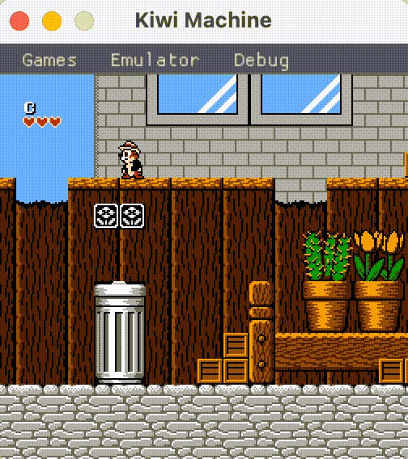
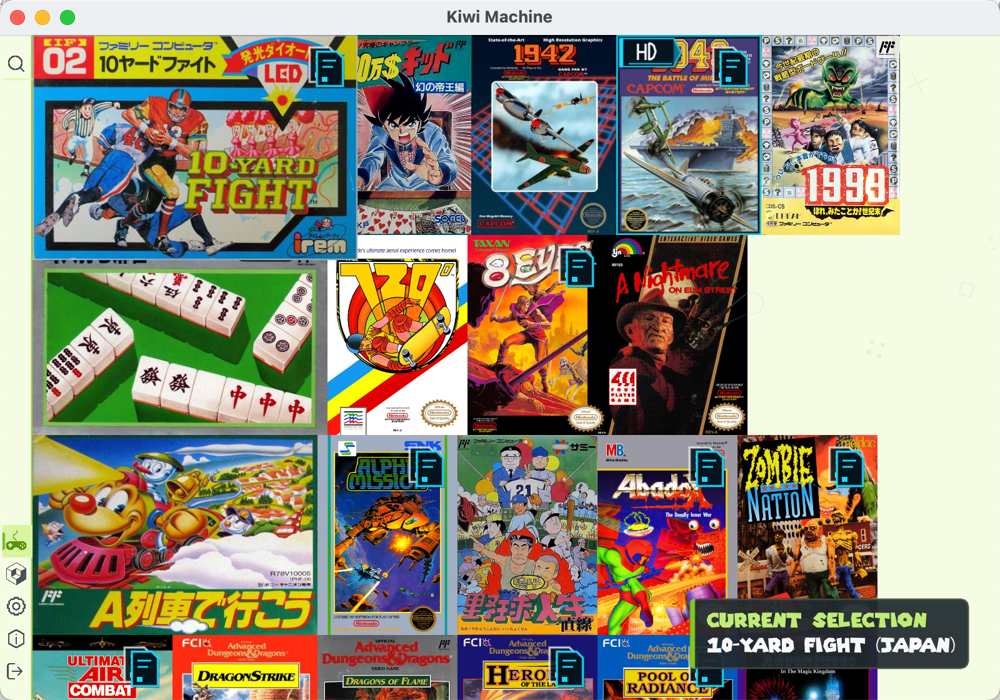
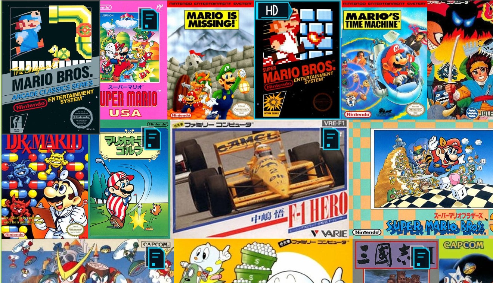
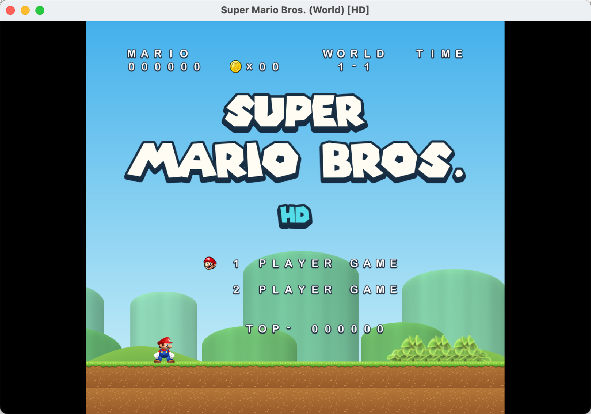
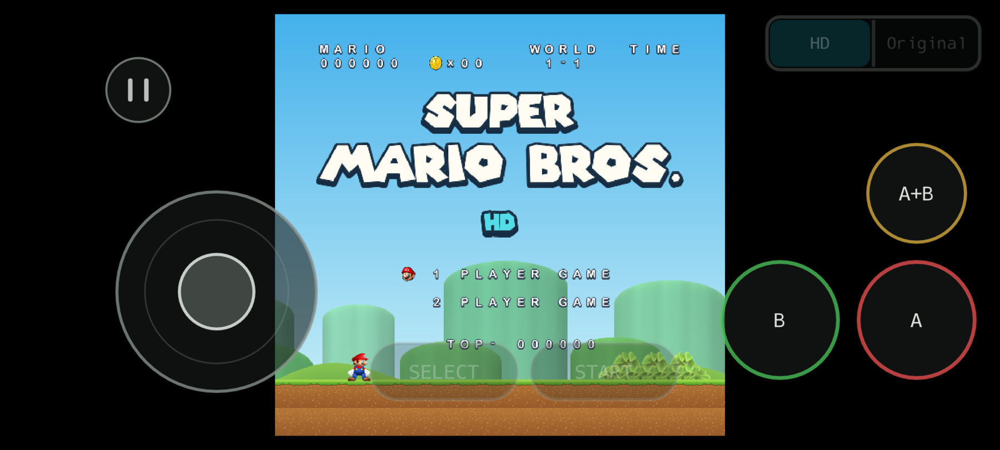
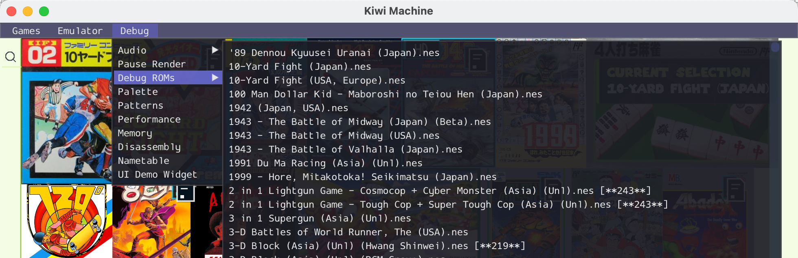

# Kiwi-Machine

### **Visit** **[Kiwi-Machine Online](https://froser.github.io)** **For Playing Online**

***




## CICD

[](https://github.com/Froser/Kiwi-Machine/actions/workflows/build_windows.yml)

[](https://github.com/Froser/Kiwi-Machine/actions/workflows/build_ubuntu.yml)

[](https://github.com/Froser/Kiwi-Machine/actions/workflows/build_macos.yml)

[](https://github.com/Froser/Kiwi-Machine/actions/workflows/build_wasm.yml)

[](https://github.com/Froser/Kiwi-Machine/actions/workflows/build_android.yml)

[](https://github.com/Froser/Kiwi-Machine/actions/workflows/build_ios.yml)

## Basic Introduction

Kiwi Machine is a simple Nintendo Entertainment System (NES/FC) emulator engine. It provides a very simple interface to help implement NES emulators on various platforms.

## Why is there a Kiwi project?

I believe many people, like me, have had a gaming dream since childhood.

When Nintendo first launched the Famicom in 1983, the concept of video game consoles wasn't popular in China yet. By the time the concept reached my surroundings, I was already in elementary school. At that time, Jackie Chan's "XiaoBaWang(小霸王) is endless fun" commercials were on TV, opening a door to the electronic world for me.

From today's perspective, although XiaoBaWang was a knockoff of the Famicom and lagged behind the actual Famicom's development by more than five years — we were playing games that were five years old — it never made me feel these games were boring. On weekends, I would take out my family's XiaoBaWang console, insert game cartridges I had played hundreds of times like Super Mario, Donkey Kong, and Lode Runner, and play games with my grandparents.

Now my grandparents have passed away, but I still remember very clearly that my grandmother and grandfather, who almost never played games, had a special fondness for Tetris, Dr. Mario, and Tank Battle respectively. These were among the games we must play on weekends. When implementing the NES emulator, these were the first games I prioritized emulating. Whenever I hear the familiar music, I always think of the times when we played games together as a child.

Later, various game consoles explosively entered China, such as GameBoy, GameBoy Advance, PS, PS2, PSP, etc. At that time, game consoles were considered evil, a stumbling block to learning and progress, so I could never convince my family to buy me a GBA or NDS. I could only watch my classmates play with eager eyes or wait for them to lend me one so I could secretly play it under the covers at night. At that time, I thought that if I had the chance in the future, I would collect all the fun games from that time so my future children could experience what games were like decades ago.

Later, I engaged in software development work and began researching the hardware architecture of the NES, the principles and formats of NES games, and started implementing an NES emulator. Although there are many mature NES emulators currently available, I thought it would be a way to fulfill a dream for myself. What I looked forward to was creating a retro gaming world of my own, so I chose to manually implement and research the core framework myself, which became today's `Kiwi Machine`.

Developing an NES emulator wasn't so smooth. On one hand, I was very busy with work, and on the other hand, there wasn't much information available. NesDev is a very comprehensive NES Wiki, and I acquired most of my NES knowledge from it. In addition, I referenced many open-source NES projects like FCEUX and debugged ROMs line by line using FCEUX's debugger to add debugging capabilities to my `Kiwi Machine`.

NES games themselves are stored in cartridges, and different cartridges have different hardware called Mappers. Different Mappers work in different ways, which brings certain difficulties to the adaptation of various games. Additionally, some games may have been implemented in unusual ways, which requires hardcoding some special cases in the emulator (such as special IRQ timing) to adapt to these games.

For example:

- In Kirby and Ninja Gaiden 3, the IRQ trigger cycle is dot 280, not 260 as stated in NesDev. I changed all IRQs to dot 280.
- Kick Master needs to trigger IRQ twice in one scanline, otherwise screen flickering will occur.
- Games like Contra, Gradius, Jackal, and Guerilla War poll $2002 to see if they've entered VBL, and reading $2002 itself clears the VBL flag, so IRQ needs to be delayed by 15 PPU cycles after VBL is generated.
- The Tetris released by Tengen (my childhood memory) selects an overflowed CHR Bank, so modulo operation is needed, otherwise the screen will garble.
- In Zelda II: The Adventure of Link, you can't press left and right at the same time, otherwise the character will float.

In addition, some games use relatively niche Mappers, such as the Japanese version of Mario using Mapper 40, Solistice using Mapper 7, and games like the Chinese localized version of Metal Max from Taiwanese manufacturers using Mapper 74. I implemented all of these myself by referring to the Wiki and FCEUX. Some games may use specialized techniques, such as writing to an illegal address to wait for the CPU, which also need to be adapted one by one.

Although the core is implemented by myself, I still used some third-party libraries:

- APU: [Nes\_Snd\_Emu](https://github.com/blarggs-audio-libraries/Nes_Snd_Emu/)
- Interface library: ImGui
- Framework foundation: SDL2
  In addition, there are some common libraries like `zlib`, which I won't list repeatedly here.

The entire Kiwi kernel code is compatible with `Chromium`, including:

- The `kiwi::base` library in Kiwi is a subset of `Chromium`'s `base` and is completely compatible in terms of interface. However, there are some adjustments in the internal implementation.
- The code specifications of the Kiwi kernel are consistent with `Chromium` code specifications and programming style.

Consistent programming style means that the Kiwi kernel uses asynchronous programming, frequently using `SequencedTaskRunner` for `PostTask()`, without using locks in kernel business, and without opening extra threads. The entire Kiwi kernel has only one UI thread and one emulator thread. The UI thread is used to interact with the UI interface, while the emulator thread is used to simulate hardware such as CPU, PPU, and APU.

## Build Methods

### Supported Platforms

- macOS
- Windows
- Linux
- Android (phone, TV)
- iOS

> ROM resources are maintained separately from the source tree. Use the
> `auto_package` target described below to generate and stage them, or configure
> CMake with `-DKIWI_PACKAGE_DIR=<directory-containing-rom-paks>` to copy
> existing ROM PAK files into the desktop application.

### Preparation Before Building

To use the separately maintained Kiwi-Machine workspace:

1. Run `python3 build.py workspace` to clone or update
   `src/third_party/Kiwi-Machine-Workspace`.
2. Configure a desktop build with `python3 build.py pc`.
3. Run `cmake --build cmake-build-debug --target auto_package`. This builds
   `package_manager` and `kiwi_machine`, generates `main.pak`, `specials.pak`,
   and `textures/*.pak`, then stages them in the desktop application's resource
   directory.

For manual editing, build the `package_manager` target and launch it with
`--workspace=<path-to-Kiwi-Machine-Workspace>`.

Android provides the following build variants:

- `debug` and `release` package the single ROM configured by
  `kiwi.demoRomZip`.
- `debugAllRoms` and `releaseAllRoms` rebuild all ROM sets from
  `kiwi.allRomsDirectory`. ROM SHA-1 indexes are generated during packaging so
  startup does not need to decompress and hash every ROM.
- `debugNoPakResource` and `releaseNoPakResource` reuse the PAK files staged by
  a previous all-ROMs build, skipping ROM indexing, packaging, and HD texture
  synchronization. Run `debugAllRoms` or `releaseAllRoms` once before using
  these faster incremental variants.

All variants store PAK files uncompressed in the APK for direct random access
and include standalone HD texture PAKs from
`kiwi.hdTexturePaksDirectory`. Run the `auto_package` target before a regular
Android build so this directory is up to date. Set `kiwi.deviceBuildType` in
`src/client/kiwi_machine_android/gradle.properties` to select the variant used
by the `app:assembleDevice` and `app:installDevice` tasks.

## Automatic Build

Kiwi-Machine provides an automated build script `build.py` to simplify the build process across different platforms. This script handles the entire build process, including dependency synchronization and platform-specific configurations.

### Usage

```bash
# Sync the workspace, configure desktop/iOS builds, and build WASM
python3 build.py

# Configure or build a specific platform
python3 build.py pc        # Configure desktop Debug and Release
python3 build.py ios       # Configure iOS Simulator Debug and Release (macOS only)
python3 build.py wasm      # Configure and build WebAssembly Debug and Release
python3 build.py workspace # Sync workspace dependencies
python3 build.py all       # Run the same workflow as the no-argument command
python3 build.py help      # Print help information

# Compile desktop/iOS projects after CMake configuration
python3 build.py pc --build
python3 build.py ios --build
python3 build.py all --build

# Generate CLion configuration files
python3 build.py pc --clion        # Generate CLion config for PC platform
python3 build.py ios --clion       # Generate CLion config for iOS platform
python3 build.py wasm --clion      # Generate CLion config for WebAssembly platform
python3 build.py all --clion       # Generate CLion config for all platforms
```

### Build Flag

For desktop and iOS builds, `build.py` configures CMake without compiling by
default. Pass `--build` to compile those targets. The WASM workflow always
configures and builds both Debug and Release.

```bash
# Only configure CMake projects (default)
python3 build.py pc

# Configure and compile projects
python3 build.py pc --build
```

### Important Note for CLion Users

If you are using CLion as your IDE, you **must** use the `--clion` flag when running the build script to generate the necessary CMakePresets.json file. This file is required for CLion to properly recognize and configure the project.

```bash
# Example: Generate CLion configuration for all platforms
python3 build.py --clion
```

### Cleanup Commands

The build script also provides cleanup commands to remove generated files:

```bash
# Remove CLion configuration directory
python3 build.py --cleanup-clion

# Remove all binary output directories
python3 build.py --cleanup
```

### Features

- **PC Build**: Configures Debug and Release for Windows, macOS, or Linux, and compiles them when `--build` is present
- **iOS Build**: Configures Debug and Release projects for the iOS Simulator on macOS, and compiles them when `--build` is present
- **WebAssembly Build**: Installs the Emscripten SDK if needed and builds both Debug and Release configurations
- **Workspace Sync**: Automatically syncs dependencies using `workspace-sync.py`
- **Apple Silicon Support**: Creates additional Intel Debug and Release configurations for compatibility

### Build Output

The script creates the following build directories:

- `cmake-build-debug`: Debug build for current platform
- `cmake-build-release`: Release build for current platform
- `cmake-build-intel-debug` (Apple Silicon only): Debug build for Intel architecture
- `cmake-build-intel-release` (Apple Silicon only): Release build for Intel architecture
- `cmake-build-ios-debug`: iOS Simulator Debug build
- `cmake-build-ios-release`: iOS Simulator Release build
- `cmake-build-emscripten-debug`: WebAssembly Debug build
- `cmake-build-emscripten-release`: WebAssembly Release build

## Manual Build

### macOS, Windows, Linux Build Methods

You can build directly using CMake. The main products are `kiwi` and `kiwi_machine`.

### Android Build Method

Open the gradle project in `src/client/kiwi_machine_android` directly for building.

### iOS Build Method

Build through CMake:

```
-G Xcode -DCMAKE_TOOLCHAIN_FILE=build/cmake/ios.toolchain.cmake -DPLATFORM=SIMULATORARM64 -DENABLE_ARC=OFF -DSDL2IMAGE_BACKEND_IMAGEIO=OFF
```

You can replace PLATFORM with your own iOS platform, see `build/ios.toolchain.cmake` for details.

### WebAssembly (WASM) Build Method

You need to download the `Emscripten` SDK (`emsdk`) first, then set the toolchain to it in CMake, for example:

```
-DCMAKE_TOOLCHAIN_FILE=/Users/user/emsdk/upstream/emscripten/cmake/Modules/Platform/Emscripten.cmake
```

### Frontend Page Build Method

This project contains a frontend project located at `src/client/kiwi_machine_wasm/kiwi-machine`

Build method:

1. First build the WebAssembly product according to the `WebAssembly (WASM) Build Method`
2. Refer to calling `src/client/kiwi_machine_wasm/update.py your WebAssembly project directory` to copy the wasm product over
3. Use npm for frontend build and deployment

### Product Introduction

- `kiwi` / `kiwi_static`: shared and static NES emulator libraries.
- `kiwi_machine`: emulator application used by the desktop and mobile clients.

### Building Your Own Game Collection

Kiwi Machine is designed in an arcade mode, with a large number of preset games that I only included after testing:


Game archives live under
`src/third_party/Kiwi-Machine-Workspace/zipped/nes`. The packaging step stores
the root collection in `main.pak` and each direct child collection in a
separate PAK such as `specials.pak`. The PAK files remain external resources;
they are not embedded in the executable.

For example:

`Bomber Man II (Japan).zip` contains two files:

- `Bomber Man II (Japan).nes` is the main ROM file.
- `Bomber Man II (Japan).jpg` is the ROM cover file.

You can put multiple matching `.nes` and `.jpg` pairs in a ZIP file; each pair
is exposed as another version of the game.

For example, I've organized many games' Japanese, English, and even Chinese
versions. A game with multiple versions displays a stacked-card icon in the
top-right corner. Click or tap the icon to switch without launching the game,
or press the configured `SELECT` button. The icon animates on the selected
game to make the action discoverable:

> 

In addition, you can also put other similar sets of files into the zip, which represent another version of the game. For example, the American version of `Rock Man` is called `Mega Man`, so they can be put into the same zip file. Kiwi-Machine provides a package manager tool to facilitate you to package resources yourself.

### HD Texture Packs

Kiwi-Machine supports standalone
[Mesen HD Packs](https://www.mesen.ca/docs/hdpacks.html). Compatible games are
matched by ROM SHA-1 and display an `HD` badge in the game library. HD editions
are prioritized while preserving the original ROM's localized title and search
aliases.



Some packs support switching between HD and original graphics while the game
is running. Press `Tab` on a keyboard or `RB` on a controller. On Android
phones and tablets, use the `HD / Original` control in the top-right corner:



### Building Debug ROMs

NES emulators are complex projects, and to test whether the emulator accurately simulates physical machines, Kiwi Machine supports custom debug ROMs.


Add `--enable_debug` to the startup parameters to evoke the menu bar and turn off the splash screen.
Add `--debug_roms=your debug path` to the startup parameters, and Kiwi Machine will display these ROMs in the debug directory after startup.
Use `--test_rom=<rom-path> --sav=<save-path> --enable_debug` to launch a ROM
with an explicit battery-backed save path. Kiwi Machine reads from and writes
back to that path. When `--sav` is omitted, Kiwi Machine uses the SHA-1-based
save under the active profile when available.

## Usage Instructions

### Kiwi's Dependencies

If you write your own emulator based on the Kiwi kernel, you can use `find_package(Kiwi REQUIRED)` to depend on the Kiwi kernel.

There are two targets in Kiwi: `Kiwi::kiwi` is a dynamic library, and `Kiwi::kiwi_static` is a static library.

For a target in a checkout of this repository, add the provided CMake module
directory and link either the shared or static Kiwi target:

```cmake
list(APPEND CMAKE_MODULE_PATH "<path-to-Kiwi-Machine>/build/cmake")
find_package(Kiwi REQUIRED)

target_link_libraries(your_emulator PRIVATE Kiwi::kiwi_static)
```

After the project dependencies are completed, you can directly include all related content by `#include <kiwi_nes.h>`.

### Creating an Emulator

You can create a Kiwi NES emulator instance through `kiwi::nes::CreateEmulator()`:

```C++
scoped_refptr<kiwi::nes::Emulator> emulator = kiwi::nes::CreateEmulator();
```

After creation, you need to call its `PowerOn()` method for initialization:

```C++
emulator->PowerOn();
```

`PowerOn()` initializes the emulator state and its task runners. The public
`kiwi::nes::Emulator` API is thread-safe. Call `PowerOff()` before releasing
the final emulator reference.

### Reading NES Files

The Emulator class has a series of LoadFromXXX functions that can read an NES ROM from a file or memory:

```C++
  virtual void LoadFromFile(const base::FilePath& rom_path,
                            LoadCallback callback) = 0;
  virtual void LoadFromBinary(
      const Bytes& data,
      LoadCallback callback,
      const LoadOptions& options = {}) = 0;
```

`LoadCallback` receives a `bool` indicating whether the ROM loaded
successfully. `LoadOptions` can enable PPU texture metadata capture for HD
renderers.

### Outputting Results

After opening an NES file, we want to output its content on a drawing surface and allow the emulator to produce sound and respond to keyboard or controller input.

Here, Kiwi abstracts a device layer called `IODevices`, representing the IO devices for emulator output. It contains three important devices:

- InputDevice: Input device, determines whether a certain NES key is pressed.
- RenderDevice: Renders one frame of NES screen.
- AudioDevice: Plays one frame of NES audio.

You need to implement these three abstract devices in order to fully interact with the emulator. If you only implement `RenderDevice`, you can only see the screen, but the emulator cannot respond to keyboard input or produce sound.

Taking `IODevices::RenderDevice` as an example, implement `NeedRender()` and
consume the current `PPUFrameData` in `Render()`:

```C++
class MyRenderDevice : public kiwi::nes::IODevices::RenderDevice {
 public:
  bool NeedRender() override;
  void Render(const kiwi::nes::PPUFrameData& frame) override;
};
```

After implementation, add it to an `IODevices` instance and pass that instance
to `Emulator::SetIODevices()`. For native rendering, `frame.width`,
`frame.height`, and `frame.native_pixels` describe the frame. When texture
metadata capture is enabled, the same structure also exposes the tile and
scroll metadata used by an HD renderer.

### Running the Virtual Machine

After the NES file is loaded, call `Emulator::Run()` to enter the running
state, then call `Emulator::RunOneFrame()` from the host's frame loop.

To simplify the call, the emulator also provides a shortcut method:

```C++
  virtual void LoadAndRun(const base::FilePath& rom_path,
                          LoadCallback callback = base::DoNothing()) = 0;
  virtual void LoadAndRun(const Bytes& data,
                          LoadCallback callback = base::DoNothing(),
                          const LoadOptions& options = {}) = 0;
```

When loading succeeds, `LoadAndRun()` calls `Run()` before invoking the
callback. The host must still call `RunOneFrame()` to advance emulation.

### Battery-Backed Saves

Kiwi Machine stores battery-backed PRG-NVRAM as raw save data under
`<profile>/Saves/<ROM_SHA1>.sav`. The application reads the ROM and save file
on its IO thread, supplies the save bytes through
`LoadAndRunWithPRGNVRAM()`, and atomically replaces the save file when flushing
modified NVRAM. The ROM identity is the SHA-1 of its PRG-ROM and CHR-ROM
contents. An automatically discovered save that cannot be imported is copied
to a unique `.invalid.bak` file before Kiwi Machine starts with empty NVRAM.
Dirty NVRAM is flushed every 30 seconds and before ROM switches, unloads,
normal exits, and application suspension.

Set `KIWI_NES_ACCEPTANCE_ROM_DIR` when running `kiwi_unittests` to validate
battery-backed round trips against local ROMs for the supported battery mapper
matrix (0, 1, 4, 5, 10, and 74).

## Resource Packaging

Kiwi-Machine provides an NES packaging tool at
`src/client/tools/package_manager`. You can use it to build your own game
resource collection.

This repository does not contain NES resources. If you need to obtain NES
resources, clone
`https://github.com/Froser/Kiwi-Machine-Workspace.git`. Open the package
manager's GUI by running
`package_manager --workspace=<path-to-Kiwi-Machine-Workspace>`.

### Auto Package

Kiwi-Machine also provides an automated packaging target `auto_package` to simplify the packaging process. This target packages all subdirectories under `zipped/nes` and every Mesen HD texture directory under `extras/mesen_hd_textures`.

To use `auto_package`:

```bash
# Build the auto_package target (will automatically build package_manager and kiwi_machine first)
cmake --build <build_dir> --target auto_package
```

The `auto_package` target will:

1. Check if `src/third_party/Kiwi-Machine-Workspace` exists
2. Process each subdirectory under `zipped/nes`, generate its ROM SHA-1 index,
   and package it into a `.pak` file
3. Package each direct child of `extras/mesen_hd_textures` as a standalone
   `.pak` file with a generated `manifest.json` containing the supported ROM
   SHA-1 values
4. Replace the old texture output and copy all generated ROM PAKs plus the
   `textures/` directory to the resources directory of `kiwi_machine`

Texture packages can also be generated directly:

```bash
package_manager \
  --mesen_hd_texture_path=<workspace>/extras/mesen_hd_textures \
  --output_path=<output>/textures
```
