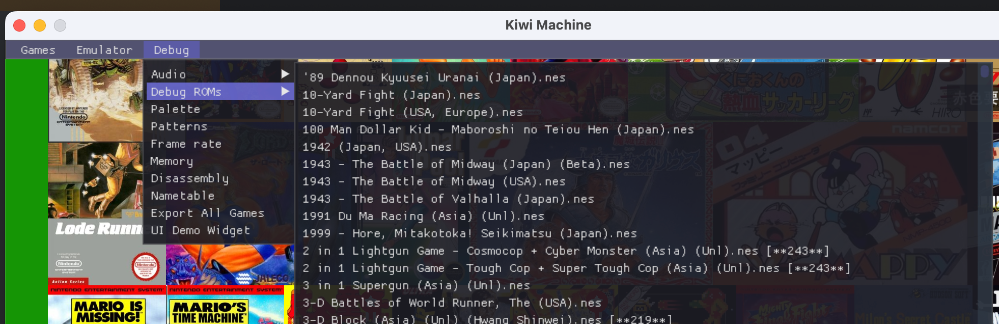

# Kiwi-NES


## 基本介绍

Kiwi NES是一个简单的任天堂红白机(NES/FC)模拟器引擎。里面提供了非常简单的接口，帮助实现各个平台下的红白机模拟器的开发。

## 构建方式

直接使用CMake可进行构建。主要的产物有`kiwi`和`kiwi_machine`。

### 支持的操作系统

- MacOS
- Windows

### 产物介绍

- kiwi：模拟器内核。
- kiwi-machine：运行在桌面端的模拟器可执行程序。

### 构建自己的游戏集合

Kiwi Machine中拥有大量预设的游戏，这些游戏都经过了测试，被Kiwi Machine完全支持：


如果你需要构建自己的游戏集合，你需要在使用CMake构建之前，打开CMake参数`KIWI_MACHINE_PRESET_ROMS`
（即`-DKIWI_MACHINE_PRESET_ROMS`)，
如此在构建的时候，Kiwi Machine将会读取`src/client/kiwi_machine/build/nes`下的所有文件，并将其写入产物二进制文件中。

`src/client/kiwi_machine/build/nes`下的每一个游戏由两个部分组成：

- 游戏名.nes
- 游戏名.jpg

例如，当目录下存在`Balloon Fight (USA).jpg`和`Balloon Fight (USA).nes`时，它才能顺利被写入Kiwi Machine中。其中，
`Balloon Fight (USA).jpg`是游戏的封面，`Balloon Fight (USA).nes`是游戏的ROM。

一旦你打开了`KIWI_MACHINE_PRESET_ROMS`，那么你需要安装Python3，因为打包的任务是由Python3所写的。

> 注意：
>
如果你使用了自己的游戏集合，那么仓库中默认的所有游戏集合将会被全部替换。解决方式是，你可以将仓库中的所有游戏先导出到某个目录，再拷贝到`nes`
> 路径下，然后再追加你自己的游戏。
>
> Kiwi-Machine提供了导出目前游戏集合的方式：
> 
> 所有的游戏将会被导出为封面jpg文件和游戏nes文件，保存到特定的一个文件夹下。

### 构建调试ROMs

红白机模拟器是一个复杂的工程，为了能测验是否模拟器精准地模拟了物理机，Kiwi Machine支持自定义调试ROMs。


在启动参数中增加`--debug_roms=你的调试DEBUG路径`，Kiwi Machine启动后就可以在调试目录下看到这些ROMs了。

## 为什么有Kiwi这个工程？

当前市面上有许多优秀的红白机开源模拟器，如Fceux、VirtuaNES等。一开始写Kiwi时，我是抱着一种好奇的心态，想研究NES的CPU、PPU、APU等各项基本原
理，看看如何模拟一个硬件系统。后来我逐渐发现，Kiwi和Fceux等不同的地方可以是，它可以集成到各个平台，包括wasm。同时，它可以集成我们预设的游戏，
而大部分模拟器更像一个工程软件，需要打开某个nes文件。Kiwi不需要多余的依赖，它可以编译成一个单独的程序，并且其中包含我们所有想要的内容。

诚然，在开发过程中我遇到了很多困难，但是也基本上都解决了它们，参考了很多资料。其中最重要的资料就是来源于
[NesDev](https://www.nesdev.org/wiki/NES_reference_guide)。

在开发过程中，内核模块（除APU）我都是自助研发。APU、基础库、底层框架等，在第三方库的基础上做了一些删减，第三方库清单如下：

第三方库：

- APU: [Nes_Snd_Emu](https://github.com/blarggs-audio-libraries/Nes_Snd_Emu/)
- 界面库：ImGui
- 框架底层：SDL2
  除此之外，还有一些如`zlib`的常用库，就不在此重复列举。

Kiwi内核的整个代码与`Chromium`保持兼容，包括：

- Kiwi中的`kiwi::base`库属于`Chromium`的`base`的一个子集，在接口上完全兼容。但是内部实现有些调整。
- Kiwi内核的代码规范与`Chromium`代码规范、编程风格保持一致。

编程风格一致，意味着Kiwi内核属于异步编程，频繁使用`SequencedTaskRunner`来进行`PostTask()`，在内核业务中不使用锁，也不开启多余的线程。
整个Kiwi内核中，只有一个UI线程和一个模拟器线程，UI线程用于与UI界面交互，模拟器线程用于模拟CPU、PPU、APU等相关硬件。

## 使用说明

### Kiwi的依赖

如果你自己编写一个基于Kiwi内核的模拟器，可以使用`find_package(Kiwi REQUIRED)`来依赖Kiwi内核。

Kiwi中有两个目标，`Kiwi::kiwi`是一个动态库，`Kiwi::kiwi_static`是一个静态库。

以Kiwi Machine为例，它使用了Kiwi的静态库目标：

```CMake
target_link_libraries(${PROJECT_NAME} PRIVATE Kiwi::kiwi_static imgui gflags_nothreads_static SDL2_image SDL2_mixer)
target_include_directories(${PROJECT_NAME} PRIVATE Kiwi::kiwi_static)
target_compile_definitions(${PROJECT_NAME} INTERFACE Kiwi::kiwi_static)
target_include_directories(${PROJECT_NAME}
        PRIVATE
        "../../third_party/imgui"
)
```

在工程依赖完毕后，你可以直接通过`#include <kiwi_nes.h>`来引入所有相关的内容。

### 创建模拟器

你可以通过`kiwi::nes::CreateEmulator()`来创建一个Kiwi NES模拟器的实例：

```C++
scoped_refptr<kiwi::nes::Emulator> emulator = kiwi::nes::CreateEmulator();
```

在创建完毕后，需要调用其`PowerOn()`方法进行初始化：

```C++
emulator->PowerOn();
```

`PowerOn()`会初始化模拟器的开机状态，并创建模拟器的工作线程。所有`kiwi::nes::Emulator`类的公开方法，都应该在UI线程，也就是你的主线程调
用，它将会在内部派发到模拟器的工作线程。所有模拟器的回调，都只会在你调用它的线程被返回。

这样设计意味着你只需要关心，你在UI线程调用模拟器的方法，那么回调函数都只会在UI线程返回，你不需要创建新的线程，使用复杂的锁来保持同步，Kiwi内部
机制保证着不会有竞争产生。

### 读取NES文件

Emulator类中有一个LoadFromXXX系列函数，可以从文件或者内存读取一个NES ROM：

```C++
  virtual void LoadFromFile(const base::FilePath& rom_path,
                            LoadCallback callback) = 0;
  virtual void LoadFromBinary(const Bytes& data, LoadCallback callback) = 0;
```

上述两个函数应该在UI线程被调用，当它读取完毕后，`callback`回调会在UI线程被返回调用。

### 将结果输出

当我们打开一个NES文件后，我们希望能够将它的内容输出在某个绘制表面上，并且能让模拟器发出声音、响应键盘或者手柄。

在这里，Kiwi抽象出来了一个设备层叫做`IODevices`，表示模拟器输出的IO设备。里面包含重要的3个设备：

- InputDevice: 输入设备，判断某个红白机的键是否被按下。
- RenderDevice: 渲染一帧红白机的画面。
- AudioDevice: 播放一帧红白机的音频。

你需要依次实现这3个抽象设备，才能完整地与模拟器来交互。假如你只实现了`RenderDevice`，那么你只能看到画面，但是模拟器无法响应键盘，也无法发出声
音。

以`RenderDevice`为例，你需要实现下面两个纯虚方法，`Render()`和`NeedRender()`：

```C++
  class NES_EXPORT RenderDevice {
   public:
    using BGRA = uint32_t;
    using Buffer = std::vector<BGRA>;

   public:
    RenderDevice();
    virtual ~RenderDevice();

   public:
    virtual void Render(int width, int height, const Buffer& buffer) = 0;
    virtual bool NeedRender() = 0;
  };
```

当你实现后，通过`Emulator::SetIODevices()`将其设置到模拟器中，当模拟器产生一帧画面时，先会回调`NeedRender()`，查询是否需要进行渲染，如果返
回`true`，则调用`Render()`，将帧的高宽以及具体的内容传递过来。

### 运行虚拟机
当NES文件被加载后，即可让模拟器开始工作了，我们需要在读取NES文件的`LoadCallback`中调用`Emulator::Run()`让它开始工作。

为了简化调用，模拟器也提供了一个快捷方法：
```C++
  virtual void LoadAndRun(const base::FilePath& rom_path,
                          base::OnceClosure callback = base::DoNothing()) = 0;
  virtual void LoadAndRun(const Bytes& data,
                          base::OnceClosure callback = base::DoNothing()) = 0;
```
它表示当读取某个ROM成功后，调用`Emulator::Run()`，然后再调用`callback`。

### 更多内容，在更新中